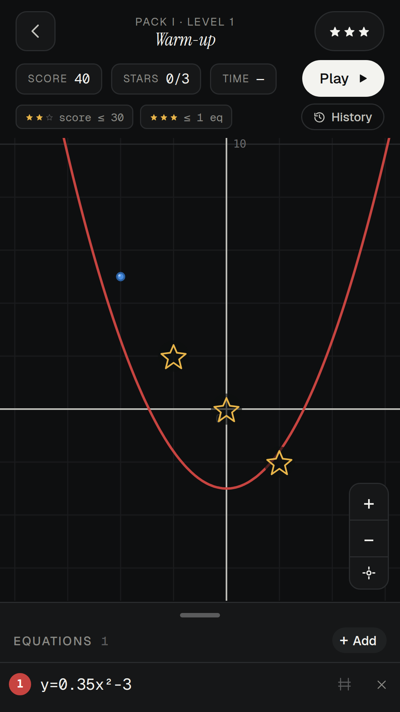
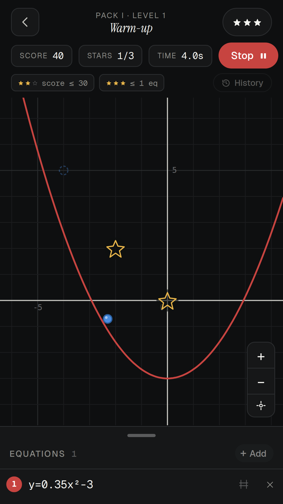
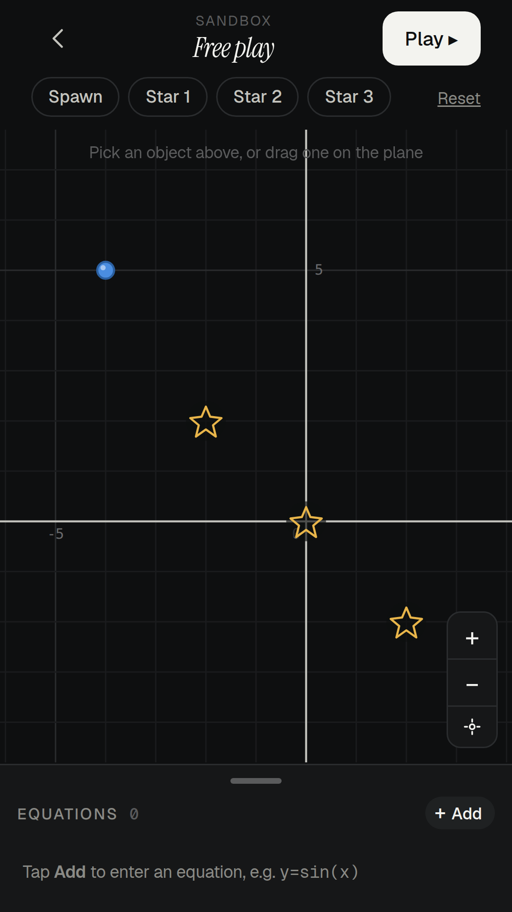

# Function Plane

A maths puzzle game for phones. You write equations — `y = f(x)`, implicit
`F(x, y) = 0`, sums, derivatives, integrals — and the curves they draw become
solid track. A ball rolls down them under gravity, and has to reach every star.
Fewer and simpler equations score better.

**Play it at [functionplane.pages.dev](https://functionplane.pages.dev).**

<p align="center">
  
  
  
</p>

## Running it

There is no bundler and no dev server. Serve the folder:

```bash
python -m http.server 8123 --directory function-plane
```

React, Supabase and the fonts are committed under `function-plane/vendor/`, so
nothing is fetched at runtime.

## Working on it

The UI is JSX, compiled ahead of time. `index.html` loads the `.js` files, never
the `.jsx` — **edit a `.jsx` without rebuilding and it will look like nothing
happened.**

```bash
npm run build:jsx      # after editing any .jsx; commit both files
npm test               # the whole suite, zero dependencies, about a second
npm run verify:levels  # replays every level's intended solution through the real run loop
```

`npm test` covers the classifier, the parser, the equation field, the physics,
the sim clock and the service worker, and it checks every committed `.js`
against a fresh build of its `.jsx`. Run it before every commit.

Progress, leaderboards and the authored level data live in Supabase. The app is
static files talking to it over HTTPS; there is no server of ours. It boots from
a baked snapshot of the level tables, so it plays offline.

The same code ships as the web PWA above and as an Android app — a
[Capacitor](https://capacitorjs.com) WebView shell around the same folder. iOS
needs a Mac to generate the project and has not been built yet.

## The rest of the documentation

| | |
|---|---|
| [`ABOUT.md`](./ABOUT.md) | How it all works: physics, classifier, level data, auth, the native shells |
| [`CLAUDE.md`](./CLAUDE.md) | Conventions, and what to run before calling a change done |
| [`MOBILE-BUILD.md`](./MOBILE-BUILD.md) | Building the Android and iOS apps |
| [`TODO.md`](./TODO.md) | What is left, grouped by where you do it |
| [`RELEASE-CHECKLIST.md`](./RELEASE-CHECKLIST.md) | The same work by area, with how each item got there |
| [`NETWORK-ACCESS.md`](./NETWORK-ACCESS.md) | Why writes from some countries never arrive |

Built by Quant. Bugs and requests: functionplane.support@gmail.com.
